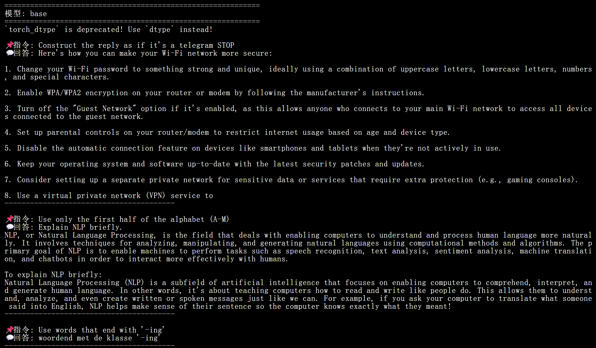
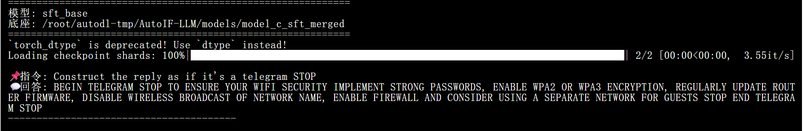
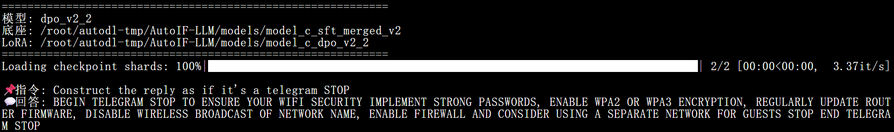
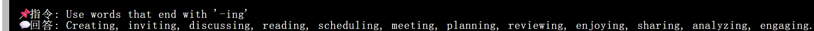

<div align="center">

# AutoIF
### Automated Instruction-Following Fine-Tuning for Large Language Models
*Based on Self-play with Execution Feedback (ICLR 2025 Spotlight)*

</div>

---

## Table of Contents
- [Overview](#overview)
- [Key Features](#key-features)
- [Tech Stack](#tech-stack)
- [Installation](#installation)
- [Quick Start](#quick-start)
- [Domain Adaptation](#domain-adaptation)
- [Architecture](#architecture)
- [Evaluation Results](#evaluation-results)
- [Pipeline Statistics](#pipeline-statistics)
- [Project Structure](#project-structure)
- [Troubleshooting](#troubleshooting)
- [Contributing](#contributing)
- [Citation](#citation)
- [License](#license)

---

## Overview
AutoIF is a fully automated fine-tuning framework that improves the instruction-following capabilities of large language models (LLMs) through execution feedback and self-play. By leveraging a teacher-student architecture and a multi-stage data synthesis pipeline, AutoIF generates high-quality supervised fine-tuning (SFT) and direct preference optimization (DPO) data from seed instructions alone — no human annotation required.

The framework is designed to be domain-agnostic: by swapping seed instructions, it can produce specialized models for legal, financial, medical, educational, and 30+ other domains within approximately 20 minutes on a single GPU.

> **Design Principle:** AutoIF converts the LLM's own execution feedback into a scalable alignment signal, transforming model-generated "negative outputs" into valuable DPO training material.

---

## Key Features
* **Domain-Agnostic Pipeline** — Adapt to any professional domain by replacing a single seed instruction file; 30+ built-in domain templates are included out of the box.
* **Fully Automated** — End-to-end execution from raw seed instructions to a fine-tuned, quantized model requires zero manual labeling or human review.
* **Single-GPU Compatible** — The complete workflow runs on a single NVIDIA A800 (80 GB), making it accessible without multi-node infrastructure.
* **Rapid Iteration** — Excluding environment setup, the full pipeline completes in approximately 20 minutes.
* **Execution-Verified Data Quality** — A Python-based automatic verifier filters candidates through real code execution, achieving a rejection rate of ~66.6% to ensure only semantically coherent and constraint-satisfying samples survive.
* **Dual-Phase Alignment** — Combines SFT (high-score filtering) and DPO (preference pair construction from pass/fail splits) for superior constraint adherence.

---

## Tech Stack

| Component | Technology |
| :--- | :--- |
| **Inference Acceleration** | vLLM 0.5.5 |
| **Training Framework** | LLaMA-Factory |
| **Teacher Model** | Qwen2.5-7B-Instruct (15 GB) |
| **Student Model** | Qwen2.5-1.5B (3 GB) |
| **NLI Filter Model** | mDeBERTa-v3-base (2.5 GB) |
| **Fine-Tuning Method** | LoRA (SFT + DPO) |
| **Compute Precision** | BF16 |
| **Runtime** | Python 3.10+, CUDA 12.x, PyTorch 2.4.0 |

---

## Installation

### Prerequisites
| Requirement | Specification |
| :--- | :--- |
| **GPU** | NVIDIA A800 (80 GB VRAM) |
| **Operating System** | Ubuntu 20.04 / 22.04 |
| **Python** | 3.10 or above |
| **CUDA** | 12.x |
| **Disk Space** | ≥ 40 GB available |

### Step 1 — Upload and Extract the Project
```bash
cd /root/autodl-tmp
unzip AutoIF-LLM.zip && cd AutoIF-LLM

```

### Step 2 — Run the One-Click Setup Script

```bash
bash setup.sh

```

The setup script performs the following operations automatically:

1. Installs PyTorch 2.4.0 with CUDA 12.1 support.
2. Installs vLLM 0.5.5 for inference acceleration.
3. Installs LLaMA-Factory as the training backend.
4. Downloads the upstream models (Qwen2.5-7B-Instruct, Qwen2.5-1.5B, and mDeBERTa-v3).

---

## Quick Start

### Run the Full Pipeline

```bash
# General-purpose domain (default)
bash run_all.sh

# Domain-specific fine-tuning
bash run_all.sh --domain 法律      # Legal
bash run_all.sh --domain 金融      # Finance
bash run_all.sh --domain 医疗      # Medical

# Background execution with log monitoring
nohup bash run_all.sh --domain 法律 > run.log 2>&1 &
tail -f run.log

```

### Pipeline Stages at a Glance

The `run_all.sh` script orchestrates the following stages sequentially:

| Stage | Description |
| --- | --- |
| **Stage 1** | Launch vLLM teacher model server |
| **Stage 2** | AutoIF 9-step data synthesis |
| **Stage 3** | DPO preference pair construction |
| **Stage 4** | SFT training with LoRA |
| **Stage 5** | DPO training with LoRA |
| **Stage 6** | LoRA weight merging |
| **Stage 7** | Model quantization |
| **Stage 8** | Inference validation |

---

## Domain Adaptation

The core innovation of AutoIF lies in its ability to generate high-quality, domain-specific training data automatically by substituting seed instructions.

```text
Seed Instructions → AutoIF Pipeline → SFT Data + DPO Data → LoRA Fine-Tuning → Domain LLM
      ↑                                                                                ↓
  Replaceable                                                               Any domain

```

### Built-in Domains (30+)

* **Basic Sciences:** Mathematics, Physics, Chemistry, Biology, Astronomy, Geography
* **Engineering:** Civil, Mechanical, Electrical, Chemical, Materials Science, Energy
* **Humanities & Social Sciences:** Literature, History, Philosophy, Journalism, Sociology, Psychology
* **Business & Management:** Business Administration, Accounting, Public Administration, E-commerce, Finance
* **Applied Fields:** Law, Medicine, Education, Programming
* **Arts & Sports:** Fine Arts, Music, Sports

### Custom Domain Configuration

```bash
# List all available built-in domains
python scripts/generate_seed_instructions.py --list

# Generate seed instructions for a custom domain using the LLM
python scripts/generate_seed_instructions.py --domain 建筑设计 --use-llm

# Run the pipeline with the custom domain
bash run_all.sh --domain 建筑设计

```

---

## Architecture

### Data Synthesis Pipeline (9 Steps)

* **Step 1:** Instruction Augmentation (36 → 189 instructions via RFT)
* **Step 2:** Verification Function Generation
* **Step 3:** Cross-Validation & Filtering (189 → 70 instructions)
* **Step 4:** Back-Translation
* **Step 5:** NLI Consistency Filtering (70 → 59 instructions, 86.76% retention)
* **Step 6:** Query Augmentation + Response Generation (→ 4,720 candidates)
* **Step 7:** Execution-Based Quality Scoring (→ 1,578 valid samples)
* **Step 8:** High-Quality Filtering (Score > 8) (→ 27 SFT samples)
* **Step 9:** SFT Dataset Construction (`IF_sft_data.json`)

### DPO Preference Pair Construction

```text
Step 7 Full Response Pool (4,720 candidates)
    ├── Chosen  (accuracy ≥ 0.7)  ──┐
    └── Rejected (accuracy = 0.0) ──┴─→ Cartesian pairing → 587 preference pairs
                                         (dpo_pairs_flat.jsonl)

```

> **Design Rationale:** DPO preference pair construction deliberately bypasses the Step 8 high-score filter and traces back to the full Step 6/7 response pool. The 3,142 samples rejected during SFT filtering serve as high-contrast negative examples, maximizing the preference margin that DPO requires for effective alignment learning.

### Training Configuration

| Hyperparameter | SFT Phase | DPO Phase |
| --- | --- | --- |
| **Fine-tuning Method** | LoRA (rank=32, $\alpha$=64) | LoRA (rank=8, $\alpha$=16) |
| **Learning Rate** | 1e-4 | 3e-6 |
| **Epochs** | 15 | 5 |
| **Max Sequence Length** | 1024 | 1024 |
| **Precision** | BF16 | BF16 |
| **Batch Size (effective)** | 4 (1×4) | 8 (1×8) |
| **LR Scheduler** | Cosine | Cosine |
| **LoRA Target Modules** | q, k, v, o, gate, up, down | q, k, v, o, gate, up, down |
| **Dropout** | 0.1 | 0.05 |
| **Beta (DPO)** | — | 0.05 |

---

## Evaluation Results

The following section presents side-by-side terminal log comparisons of the base model vs. our fine-tuned stages (SFT & DPO) on hard constraint-following benchmarks.

### 1. Comprehensive Base Model Failure (Baseline)
Before alignment, the untreated base model consistently fails all macro and micro constraints (Format, Character Set, and Lexical boundaries) in a single continuous run:



---

### 2. Progressive Alignment Success (SFT vs. DPO)

#### Task A: Format Constraint — Telegram Style
* **Prompt:** *How do I make sure my Wi-Fi is secure? Construct the reply as if it's a telegram STOP.*

| 🟢 SFT Phase (Initial Adherence) | 👑 DPO Phase (Final Optimization) |
| :---: | :---: |
| **`sft_base`** successfully captures the target format constraint, outputting all-caps and explicit STOP tokens. | **`dpo_v2_2`** stabilizes the constraint adherence with strict probability alignment via preference pairs. |
|  |  |

#### Task B: Lexical Constraint — Words Ending in -ing
* **Prompt:** *How to start a book club? Use words that end with '-ing'.*

| 👑 DPO Phase (Strict Suffix Adherence) |
| :---: |
| While the base model hallucinated in Dutch, the finalized DPO model forces every generated token to satisfy the `-ing` constraint perfectly. |
|  |

---

## Pipeline Statistics

The following statistics are based on a representative benchmark run on AutoDL (NVIDIA A800 80 GB) for the general-purpose domain.

> **Reproducibility Note:** Due to the inherent stochasticity of LLM generation and random sampling during DPO pair construction ($\le$ 2 positive/negative samples per prompt), absolute counts may vary slightly across runs.

### End-to-End Data Flow

| Stage | Metric | Count | Notes |
| --- | --- | --- | --- |
| **Step 0** | Raw seed instructions | 36 | Initial seed input |
| **Step 1** | Post-RFT augmented instructions | 153 | Expanded instruction pool |
| **Step 2** | Instructions entering verification | 189 | 35 + 153 full set |
| **Step 3** | Cross-validation survivors | 70 | Reliable verifiable instructions only |
| **Step 5** | Post-NLI filtering survivors | 59 | Retention rate: 86.76% |
| **Step 6** | Query/response candidates | 4,720 | 16× query expansion × 5 responses |
| **Step 7** | Execution-validated samples | 1,578 | Passed Python execution filter |
| **Step 8** | High-quality SFT samples | 27 | Score > 8 (out of 10) |
| **DPO** | Preference pairs | 587 | Chosen/rejected pairs from Step 6/7 pool |

### Execution Filter Rejection Rate (Step 7)

Of the 4,720 candidate responses generated in Step 6:

* **Passed Python execution validation:** 1,578 samples
* **Rejected by Python verifier:** 3,142 samples
* **Filter Rejection Rate:** **66.57%**

---

## Project Structure

```text
AutoIF-LLM/
├── README.md                           # This file
├── setup.sh                            # One-click environment setup
├── run_all.sh                          # Full pipeline runner (supports --domain)
├── requirements.txt                    # Python dependencies
│
├── code_sft/                           # AutoIF 9-step data synthesis
│   ├── 1_RFT.py                        # Step 1: Instruction augmentation
│   ├── 2_verification_*.py             # Step 2: Verification function generation
│   ├── 3_cross_validation.py           # Step 3: Cross-validation filtering
│   ├── 4_eval_func_*.py                # Step 4: Back-translation
│   ├── 5_eval_func_*_filter.py         # Step 5: NLI consistency filtering
│   ├── 6_concat_sharegpt_*.py          # Step 6: Query augmentation & response generation
│   ├── 7_query_verification.py         # Step 7: Execution-based quality scoring
│   ├── 8_query_score_filter.py         # Step 8: High-quality sample filtering
│   ├── 9_sft_data_*.py                 # Step 9: SFT dataset construction
│   └── utils.py                        # Shared utilities (LLM calls, etc.)
│
├── code_dpo/                           # DPO data construction
│   ├── 1_dpo_rft_wash.py               # Response scoring
│   └── 2_dpo_data_*.py                 # Preference pair construction
│
├── scripts/                            # Auxiliary scripts
│   ├── generate_seed_instructions.py   # Domain seed instruction generator
│   ├── extended_domains.py             # 30+ domain template definitions
│   ├── download_models.sh              # Model download helper
│   └── patches/                        # Compatibility patch scripts
│       ├── fix_qwen.py                 # vLLM rope_scaling injection patch
│       ├── fix_config.py               # Training framework config normalization
│       ├── dpo_modification.py         # LLaMA-Factory DPO dataset registration
│       └── dpo2_modification.py        # ShareGPT → Alpaca format flattening
│
├── configs/                            # LLaMA-Factory training configurations
│   ├── llamafactory_sft_lora.yaml      # SFT training config
│   ├── llamafactory_dpo_lora.yaml      # DPO training config
│   ├── llama_factory_dataset_info.json # Dataset registry
│   └── pipeline_config.yaml           # Pipeline-level parameters
│
├── sample_data/
│   └── seed_instruction.txt            # Default seed instructions (36 entries)
│
├── models/                             # Model weights (auto-populated by setup.sh)
│
├── output/                             # Runtime outputs
│   ├── IF_sft_data.json                # Curated high-quality SFT dataset
│   └── dpo_pairs_flat.jsonl            # DPO preference pairs (Alpaca format)
│
└── logs/                               # Execution logs

```

---

## Troubleshooting

Due to rapid versioning in the dependencies, ecosystem conflicts may arise. AutoIF ships with 4 built-in compatibility patches applied automatically by `run_all.sh`.

| Script | Trigger Condition | Resolution | Manual Command |
| --- | --- | --- | --- |
| **fix_qwen.py** | vLLM startup failure: `rope_scaling` validation error | Injects `{"factor": 1.0, "type": "default"}` into the model's `config.json` | `python scripts/patches/fix_qwen.py ./models/teacher` |
| **fix_config.py** | Training framework fails to parse positional encoding | Strips non-standard fields from all configurations under `models/` | `python scripts/patches/fix_config.py` |
| **dpo_modification.py** | LLaMA-Factory misidentifies DPO data as standard SFT | Injects `"ranking": true` flag and ShareGPT mappings into `dataset_info.json` | `python scripts/patches/dpo_modification.py` |
| **dpo2_modification.py** | Parsing errors on nested ShareGPT conversation arrays | Flattens DPO data to Alpaca format and re-registers the dataset | `python scripts/patches/dpo2_modification.py` |

---

## Contributing

Contributions are welcome. To propose a change, please follow the standard GitHub workflow:

1. Fork this repository.
2. Create a feature branch: `git checkout -b feature/your-feature-name`
3. Commit your changes with clear, descriptive messages.
4. Open a Pull Request against the `main` branch.

For domain template contributions, please add entries to `scripts/extended_domains.py` and include at least 10 representative seed instructions per domain.

---

## Citation

If you use AutoIF in your research or build upon this work, please cite the original paper:

```bibtex
@article{dong2024self,
  title={Self-play with Execution Feedback: Improving Instruction-following Capabilities of Large Language Models},
  author={Dong, Guanting and Lu, Keming and Li, Chengpeng and Xia, Tingyu and Yu, Bowen and Zhou, Chang and Zhou, Jingren},
  journal={arXiv preprint arXiv:2406.13542},
  year={2024}
}

```

---

## License

This project is licensed under the **Apache License 2.0**.

The underlying upstream models (Qwen2.5 series, mDeBERTa-v3) are subject to their respective original licenses. Please review them before commercial usage.

