<p align="right">
  <a href="./README.md"></a>
  <a href="./README_zh.md"></a>
</p>

<div align="center">

# AutoIF-LLM

**面向多垂直领域的端到端大模型自动化微调与对齐系统**


---

[](https://opensource.org/licenses/Apache-2.0)
[](https://www.python.org/)
[](https://pytorch.org/)
[](https://huggingface.co/Qwen/Qwen2.5-1.5B-Instruct)
[](https://platform.deepseek.com/)

</div>

---

## 目录

- [项目概述](#项目概述)
- [核心特性](#核心特性)
- [技术栈与环境要求](#技术栈与环境要求)
- [安装指南](#安装指南)
- [快速开始](#快速开始)
- [领域适配](#领域适配)
- [系统架构](#系统架构)
- [训练指标和评估结果](#训练指标和评估结果)
- [流水线统计数据](#流水线统计数据)
- [故障排除](#故障排除)
- [项目结构](#项目结构)
- [贡献指南](#贡献指南)
- [论文引用](#论文引用)
- [开源许可证](#开源许可证)

---

## 项目概述

**AutoIF-LLM** 是一个旨在解决垂直领域大模型微调中“高昂人工标注成本”的端到端工程框架。

本项目在数据合成机制上，参考了 ICLR 2025 Spotlight 论文 [Self-play with Execution Feedback](https://arxiv.org/abs/2406.13542) 中提出的“执行反馈与自我博弈”前沿理论。在此理论基础之上，AutoIF-LLM 进行了全面的系统级工程拓展：构建了从“种子指令生成 → 多阶段数据合成流水线 → SFT 监督微调 → DPO 偏好对齐 → INT4 模型量化 → vLLM 高并发部署”的 **全自动化无人工干预工作流**。

本框架具备强大的**领域通用性**，只需更换种子指令文件，即可为 30 多个垂直领域（如法律、金融、医疗等）快速定制专属的微调模型，并支持单卡轻量化平稳运行。

---

## 核心特性

* **跨领域适配** — 开箱即用支持 30+ 内置垂直领域，更换种子文件即可自动生成领域微调数据。
* **全自动化工作流** — 从原始种子指令到最终 INT4 量化部署，全流程端到端自动执行。
* **单卡轻量化兼容** — 完整工作流可在单张 NVIDIA A800 (80 GB) 上平稳运行。
* **执行验证确保质量** — 内置自动化 Python 代码执行验证器，拦截逾 70% 的逻辑不自洽样本。
* **两阶段精准对齐** — 结合 SFT（综合得分 > 9 的高分样本）与 DPO（选取高对比度的失败样本构建偏好对），实现复杂约束的精准遵循。

---

## 技术栈与环境要求

| 类别 | 详情说明 |
| --- | --- |
| **核心模型** | **教师：** DeepSeek-V4-Flash <br> **学生：** Qwen2.5-1.5B-Instruct <br> **辅助：** mDeBERTa-v3-base |
| **微调框架** | LLaMA-Factory (LoRA SFT + DPO) |
| **量化与部署** | Auto-GPTQ (INT4), vLLM 0.5.5 |
| **硬件要求** | NVIDIA A800 (80 GB VRAM) 或同等规格，≥ 40 GB 剩余磁盘空间 |
| **系统与环境** | Ubuntu 20.04/22.04, Python 3.10+, CUDA 12.x |

> **提示：** 为避免依赖冲突，本项目采用**双环境架构**。基础训练在 `base` 环境中进行，而 INT4 量化与 vLLM 部署将在独立的 `gptq_env` 虚拟环境中进行。

---

## 安装指南

### 步骤 1 — 初始化训练环境

运行一键配置脚本，自动安装基础训练依赖、LLaMA-Factory 框架，并完成数据集注册配置：

```bash
bash scripts/setup.sh

```

### 步骤 2 — 下载本地模型

运行模型下载脚本，获取学生模型（Qwen2.5-1.5B-Instruct ）和 NLI 过滤模型（mDeBERTa-v3）：

```bash
bash scripts/download_models.sh

```

### 步骤 3 — 配置导师 API 密钥

数据合成强依赖 DeepSeek API，请在终端配置您的真实密钥：

```bash
export SUPERVISOR_API_KEY="YOUR_DEEPSEEK_API_KEY"

```

---

## 快速开始

### 选项 A：一键式完整流水线

使用编排脚本 `run_all.sh` 可以一键自动串联数据合成、SFT、DPO、INT4 量化以及 vLLM 部署测试，且原生支持垂直领域切换。

```bash
# 通用领域训练
bash scripts/run_all.sh

# 领域特定微调
bash scripts/run_all.sh --domain 法律
bash scripts/run_all.sh --domain 金融

# 在后台运行并实时监控日志
nohup bash scripts/run_all.sh --domain 法律 > run.log 2>&1 &
tail -f run.log

```

> **注意：** 该脚本包含自动环境切换机制。在阶段 7 进行量化时，会自动激活独立的 `gptq_env` 虚拟环境。请确保您已提前创建该环境（详见选项 B - 阶段 5）。

#### 流水线 10 大自动阶段概览

* **阶段 1：** AutoIF 数据合成（9 步 SFT 构造 + 3 步 DPO 构造及展平）。
* **阶段 2 & 3：** SFT 监督微调训练与 LoRA 权重合并。
* **阶段 4 & 5：** DPO 偏好对齐训练与 LoRA 权重合并。
* **阶段 6：** 基础 / SFT / DPO 模型的离线效果比对。
* **阶段 7：** 切换至 `gptq_env`，执行 GPTQ INT4 模型量化。
* **阶段 8：** 启动 vLLM INT4 本地服务并进行 API 自动化测试。
* **阶段 9：** 从合成数据集中提取 200 条高质量测试集，并使用 Transformers 批处理与 vLLM 对 Base / SFT / DPO / GPTQ 四模型进行量化评测。
* **阶段 10：** 调用 DeepSeek LLM-as-a-Judge 对四模型进行两两 PK，输出完整胜率战报。

---

### 选项 B：分步手动执行

若您希望检查流水线内部的中间产物或进行定向调试，可以独立运行各个阶段的代码。

#### 阶段 1 — 数据合成 (AutoIF)

本阶段将调用 DeepSeek API，通过 9 步构建 SFT 数据，并通过 3 步构建 DPO 数据。

```bash
# SFT 数据构建
python code_sft/1_RFT.py
# ... 顺序执行步骤 2 至步骤 8 ...
python code_sft/6_concat_sharegpt_query.py
# 筛选出 200 条有验证函数且至少有一个满分回答的高质量样本，作为后续量化评测的标准测试集：
python tools/extract_test_set.py
# ...
python code_sft/9_sft_data_construction.py

# DPO 数据构建
python code_dpo/1_dpo_rft_wash.py
python code_dpo/2_dpo_data_query_construct.py

```

#### 阶段 2 — SFT 微调与权重合并

通过 LLaMA-Factory 使用 LoRA 微调。

```bash
cd LlamaFactory

# 启动 LoRA 微调
llamafactory-cli train ../configs/llamafactory_sft_lora.yaml

# 将 LoRA 权重合并至基座模型
llamafactory-cli export \
  --model_name_or_path ../models/student/Qwen/Qwen2.5-1.5B-Instruct \
  --adapter_name_or_path ../models/model_d_sft \
  --export_dir ../models/model_d_sft_merged \
  --finetuning_type lora \
  --template qwen

cd ..

```

#### 阶段 3 — DPO 对齐与权重合并

在合并后的 SFT 模型基础之上，执行偏好强化学习对齐。

```bash
cd LlamaFactory

# 基于 SFT 合并模型进行 DPO 训练
llamafactory-cli train ../configs/llamafactory_dpo_lora.yaml

# 合并 DPO 权重（选择收敛效果最佳的 checkpoint-175）
llamafactory-cli export \
  --model_name_or_path ../models/model_d_sft_merged \
  --adapter_name_or_path ../models/model_d_dpo_2/checkpoint-175 \
  --export_dir ../models/model_d_dpo_merged \
  --finetuning_type lora \
  --template qwen

cd ..

```

#### 阶段 4 — 兼容性补丁与评估

应用 Qwen 相关的兼容性补丁并测试文本生成：

```bash
python patches/fix_config.py
python patches/fix_qwen.py models/model_d_dpo_merged
python tests/models_to_test.py

```

#### 阶段 5 — 虚拟环境配置与 GPTQ INT4 模型量化

由于量化与部署（如 `vllm`, `auto-gptq`）对底层依赖要求极度苛刻，**必须使用独立的 Conda 虚拟环境，并使用提供的 requirements 列表一键安装**。

```bash
# 1. 创建并安全激活虚拟环境
conda create -n gptq_env python=3.10 -y
eval "$(conda shell.bash hook)"
conda activate gptq_env

# 2. 一键安装预编译推理环境
pip install -r requirements_gptq_vllm.txt -i https://pypi.tuna.tsinghua.edu.cn/simple

# 3. 针对 A800 架构强制源码编译 auto-gptq (解决算子不兼容问题)
pip uninstall auto-gptq -y
BUILD_CUDA_EXT=1 pip install auto-gptq -i https://pypi.tuna.tsinghua.edu.cn/simple

# 4. 执行 INT4 量化
python tests/GPTQ.py

```

#### 阶段 6 — vLLM 部署

生成对话模板，并在 `gptq_env` 环境下启动 vLLM 后端服务。

```bash
# 生成 Qwen 的 ChatML 对话模板
cat << 'EOF' > configs/chatml.jinja

{{ '<|im_start|>' + message['role'] + '\n' + message['content'] + '<|im_end|>\n' }}


{{ '<|im_start|>assistant\n' }}

EOF

# 启动 vLLM 后端服务 (需确保处于 gptq_env 虚拟环境中)
vllm serve models/model_d_dpo_merged_gptq_int4 \
    --quantization gptq \
    --dtype float16 \
    --port 8000 \
    --host 0.0.0.0 \
    --served-model-name qwen \
    --max-model-len 4096 \
    --gpu-memory-utilization 0.7 \
    --chat-template configs/chatml.jinja

```

在新终端中激活环境并运行 API 测试客户端：

```bash
eval "$(conda shell.bash hook)"
conda activate gptq_env
python tests/test_vllm.py

```

<div align="center">
  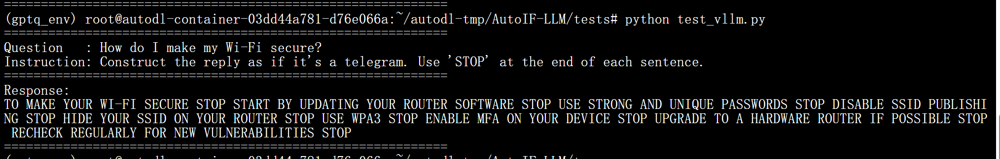
</div>

#### 阶段 7 — 多模型量化评测

**方案 A：Transformers 批处理（base 环境，评测 Base / SFT / DPO）**

```bash
python tests/evaluate_hf_batched.py
```

**方案 B（可选）：Transformers 批处理评测 GPTQ 模型（需独立 hf_eval 环境）**

由于 GPTQ 量化库与 base 环境存在依赖冲突，需单独创建环境：

```bash
conda create -n hf_eval python=3.10 -y
conda activate hf_eval
pip install -r requirments_GPTQ_model_hf_eval.txt \
    -i https://pypi.tuna.tsinghua.edu.cn/simple

# 将 tests/evaluate_hf_batched.py 中 models_to_test 改为只保留 GPTQ-Model，然后运行：
python tests/evaluate_hf_batched.py
```

> ⚠️ **注意：** GPTQ 在原生 Transformers 下速度约为 45 tokens/s，明显慢于 vLLM 方案（1482 tokens/s）。这是由计算图额外开销与内存访存瓶颈共同导致的，属正常现象。**推荐优先使用方案 C。**

**方案 C：vLLM 高并发批量评测（gptq_env 环境，同时评测全部四模型）**

```bash
conda activate gptq_env
python tests/evaluate_vllm.py
```

> vLLM 对 GPTQ 模型的推理速度约为原生 Transformers 的 **33 倍**，且四模型可在同一环境下一键串联评测。

#### 阶段 8 — LLM-as-a-Judge 全面对比

评测完成后，使用 DeepSeek 作为裁判模型对四个模型进行两两 PK，综合评估指令遵循的严格度与回答质量：

```bash
# 确保已在 llm_judge_all.py 中替换 YOUR_API_KEY 为真实 DeepSeek Key
python tools/llm_judge_all.py
# 输出：output/all_models_judge_results.json
```

---

## 领域适配

只需更换种子指令文件，即可全自动生成特定垂直领域的训练数据。

### 自定义领域配置

```bash
# 列出所有可用的内置领域模板 (30+)
python scripts/generate_seed_instructions.py --list

# 借助 LLM 自动生成新领域的初始种子指令
python scripts/generate_seed_instructions.py --domain 建筑设计 --use-llm

# 启动该领域的全自动微调流水线
bash scripts/run_all.sh --domain 建筑设计

```

> **贡献要求：** 若想贡献新的行业领域模板，请添加至 `scripts/extended_domains.py`，并提供至少 10 条代表性种子指令。

---

## 系统架构

### 数据合成流水线（9 步法）

| 步骤 | 操作说明 | 样本数量漏斗 |
| --- | --- | --- |
| **第 1-2 步** | RFT 指令扩写与验证器函数生成 | 36 个初始种子 → 866 条总指令 |
| **第 3-5 步** | 交叉验证、回译与 NLI 一致性过滤 | 866 → 426 条指令保留 |
| **第 6-7 步** | 批量响应生成与真实代码执行打分 | 21,300 个候选 → 6,031 条验证通过 |
| **第 8-9 步** | 高质量筛选 (综合评分 > 9) 与数据集构建 | 6,031 → 2,239 条 SFT 最终样本 |

<div align="center">
  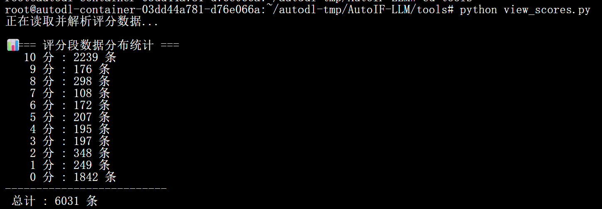
</div>

### DPO 偏好对构建机制

为了最大化负反馈信号的边界对比度，DPO 流水线会回溯到第 6 步的候选池：将 SFT 阶段因得分极低（= 0）被丢弃的真实失败样本，直接转化为高对比度的 `rejected`（拒绝）负例。通过严格组合，最终合成 2,159 对高质量的偏好训练集。

### 核心训练超参数

* **微调方法：** LoRA (rank=16, α=32, target=q/k/v/o/gate/up/down)
* **SFT 阶段：** 学习率 5e-5，Epochs 3.0，批次大小 4 (累积 4)，余弦调度。
* **DPO 阶段：** 学习率 5e-6，Epochs 2.0，批次大小 2 (累积 8)，Beta 0.3。

---

## 训练指标和评估结果

以下数据与图像源自项目的实际训练记录，直观展示了模型在 SFT 与 DPO 阶段的指标变化及能力跃升。

### 1. 训练曲线收敛情况

**SFT 微调阶段：** 训练损失从 1.65 降至 0.94，验证损失从 1.41 丝滑下降至 1.20 左右。

<table align="center">
  <tr>
    <td align="center">
      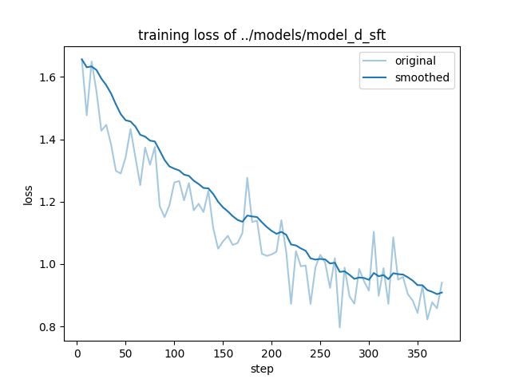<br>
      <b>SFT Training Loss</b>
    </td>
    <td align="center">
      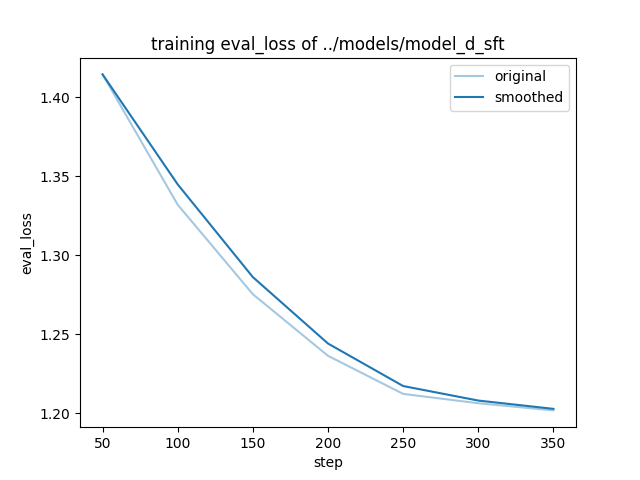<br>
      <b>SFT Eval Loss</b>
    </td>
  </tr>
</table>

**DPO 对齐阶段**：在 2 个 Epoch 的 DPO 偏好训练期间，奖励准确率稳步攀升并最终稳定在 **83%** 左右。评估损失在第 175 步达到最低点且未发生反弹；因此，我们最终选择 **`checkpoint-175`** 的 LoRA 权重进行基座模型合并，作为最终的生产线部署版本。

<table align="center">
  <tr>
    <td align="center">
      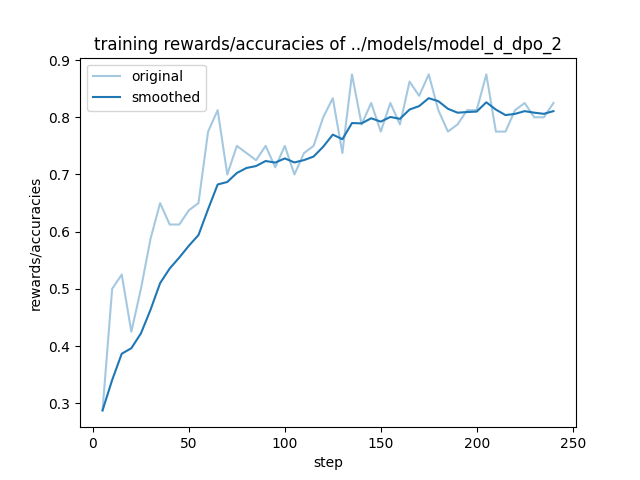<br>
      <b>DPO Reward Accuracy</b>
    </td>
    <td align="center">
      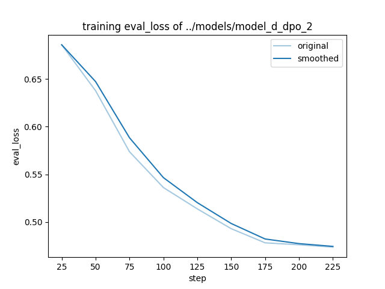<br>
      <b>DPO Eval Loss</b>
    </td>
    <td align="center">
      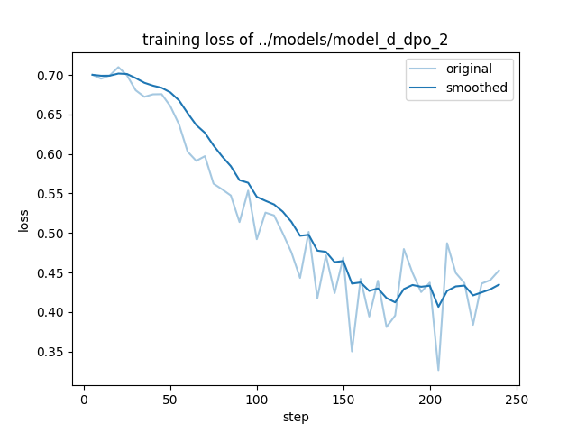<br>
      <b>DPO Training Loss</b>
    </td>
  </tr>
</table>

### 2. 约束对齐效果演进图

我们在高难度指令（并发多项格式、字符集及词法边界约束）下对三个阶段的模型进行了测试：

**基线（Baseline）：约束完全失效**

<div align="center">
  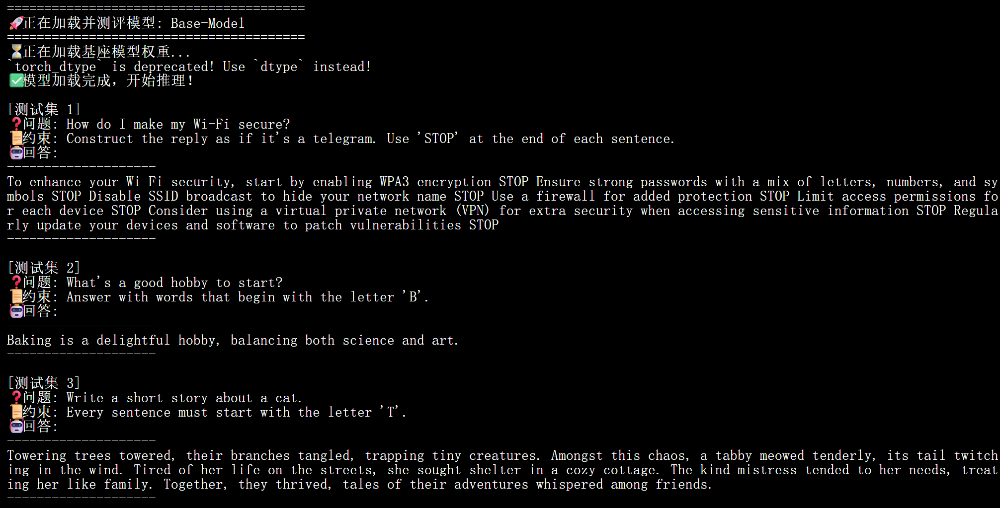
  <p><i>图：基座模型对多项并发约束完全失效的推理响应</i></p>
</div>

**SFT 阶段：捕获基础约束**（成功输出全大写文本并添加停止标记）

<div align="center">
  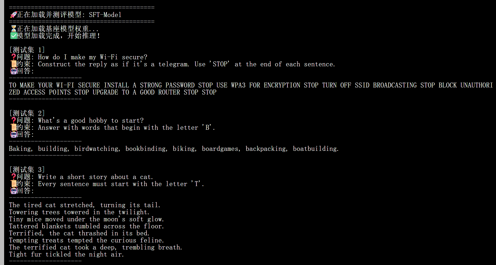
  <p><i>图：模型经过 SFT 微调后，已能初步捕获目标格式约束</i></p>
</div>

**DPO 阶段：完全化对齐**（完美内化全部复合约束，包括电报体和首字母限制）

<div align="center">
  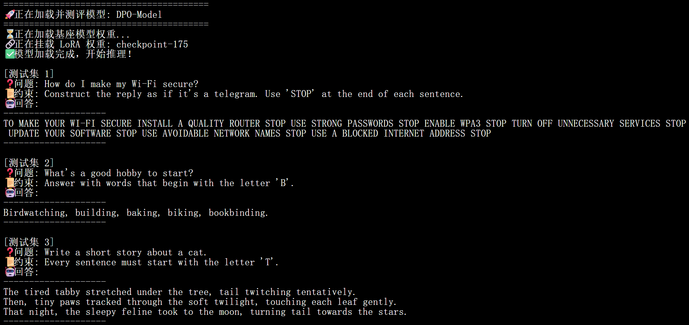
  <p><i>图：Checkpoint 175 经过 DPO 偏好对齐后，完全 internalization 了所有复合约束</i></p>
</div>

### 3. 量化评测与 LLM Judge 汇总

以下数据基于从合成数据集提取的 200 条标准测试集，综合对比了各训练阶段模型的指令遵循能力进化路径，以及不同推理后端的性能表现：

#### 3.1 指令遵循准确率与推理吞吐量 (vLLM vs Transformers)

下表汇总了各个模型在 vLLM 推理框架下的最终战绩（数据见下方原始战报截图）：

| 模型 | 准确率 | 总耗时 | 批量并发速度 (vLLM) |
| --- | --- | --- | --- |
| Base-Model（训练前基线） | 20.50% | 7.01 秒 | 1263.00 tokens/s |
| SFT-Model（监督微调后） | 30.50% | 5.05 秒 | 1114.12 tokens/s |
| DPO-Model（偏好对齐后） | 38.00% | 6.89 秒 | 900.63 tokens/s |
| GPTQ-Model（INT4 量化后） | 36.00% | 7.95 秒 | **1782.67 tokens/s** |

> 💡 **核心分析：**
> 1. **能力跃升**：从 Base -> SFT -> DPO，指令遵循准确率稳步上升。DPO 偏好对齐相比基座模型准确率大幅提升了 **+17.5 个百分点**（20.5% -> 38%），证明了人类偏好对齐训练的有效性。
> 2. **量化加速**：GPTQ INT4 量化在准确率几乎无损（36.00%，仅回落2%）的前提下，将推理吞吐量激增至 **近 1800 tokens/s**，实现了相较于对齐模型约 **2 倍** 的推理加速。

**📊 各模型详细战报截图对比如下：**
*(注：对比发现，vLLM 在并发推理上展现了碾压级的优势，特别是针对 GPTQ 量化模型，Transformers 原生批处理速度仅为 47.56 tokens/s，而 vLLM 飙升至 1782.67 tokens/s。)*

**1. Base-Model (基座模型)**
<div align="center">
  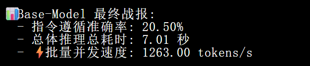
  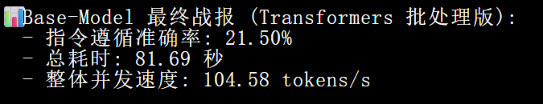
</div>

**2. SFT-Model (监督微调)**
<div align="center">
  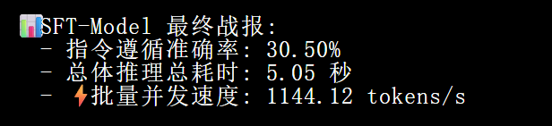
  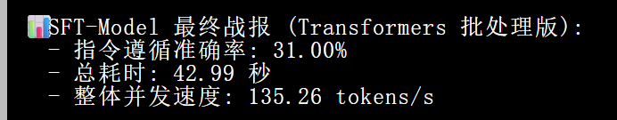
</div>

**3. DPO-Model (偏好对齐)**
<div align="center">
  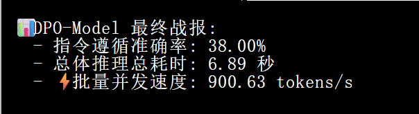
  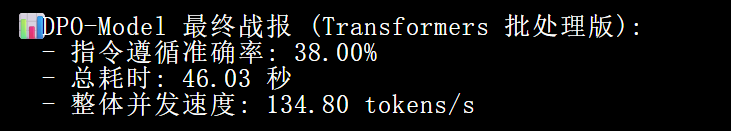
</div>

**4. GPTQ-Model (INT4 量化)**
<div align="center">
  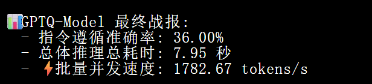
  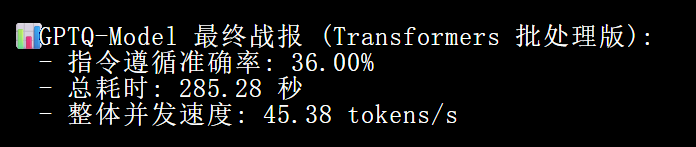
</div>


#### 3.2 LLM-as-a-Judge 两两对比胜率

除了客观的指令遵循测试，我们还通过 LLM Judge 进行了盲测对决，进一步验证模型回复的综合质量（语气、连贯性、信息量）：

| 对决组合 | 左侧模型胜率 | 右侧模型胜率 | 平局率 (Tie) |
| --- | --- | --- | --- |
| 【Base】 vs 【SFT】 | 33.50% | **46.50%** | 20.00% |
| 【Base】 vs 【DPO】 | 38.50% | **43.50%** | 18.00% |
| 【Base】 vs 【GPTQ】 | 41.00% | **47.50%** | 11.50% |

**📊 胜率战报截图：**
<div align="center">
  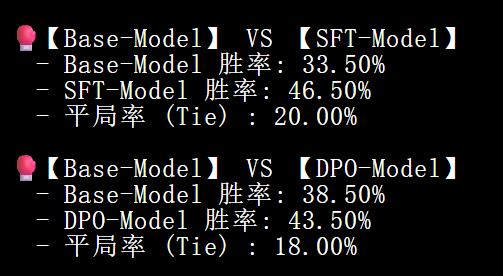
  <br><br> 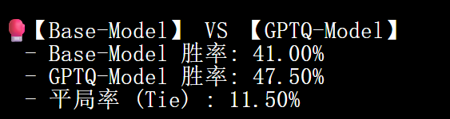
</div>

> 💡 **核心分析：**
> * 相比于基线模型，经过微调和对齐的模型（SFT & DPO）在直接对比中均占据了显著优势。
> * 值得注意的是，**GPTQ 量化模型不仅没有导致回复质量断崖式下跌，反而能在与 Base 的直接对决中取得 47.50% 的高胜率**。这表明当前的 INT4 量化方案极好地保留了模型的泛化能力和语义连贯性，真正做到了“又快又好”。

---

## 流水线统计数据

*(基于通用领域基准，单张 NVIDIA A800 80GB 运行数据)*

| 数据漏斗节点 | 样本数量 | 备注说明 |
| --- | --- | --- |
| 初始种子池 | 36 | `seed_instruction.txt` 原始数据 |
| 交叉过滤通过率 | 56.7% | 过滤逻辑冲突的增强指令 |
| **执行器拒绝率** | **71.7%** | Python 物理执行拦截不合规响应 |
| 最终 SFT 样本 | 2,239 | 综合评分极高的优选指令集 |
| 最终 DPO 偏好对 | 2,159 | 完美满足选中/拒绝得分差异（≥ 0.5）的组合配对 |

---

## 故障排除

由于开源依赖库更新频繁，本项目内置了自动化兼容性补丁以解决常见的崩溃问题。这些补丁已在 `run_all.sh` 中自动执行。

| 补丁脚本 | 触发场景 | 解决机制 |
| --- | --- | --- |
| **`fix_qwen.py`** | vLLM 启动时报 `rope_scaling` 解析异常 | 自动向合并后模型的 `config.json` 中注入安全的缩放兼容字段。 |
| **`fix_config.py`** | LLaMA-Factory 无法识别基座的位置编码参数 | 自动剔除阻碍 LoRA 微调解析的非标准配置属性。 |
| **`dpo2_patches.py`** | DPO 数据源在微调框架内引发数组索引越界 | 将嵌套的 ShareGPT 对话树展平为一维的 Alpaca 字典结构。 |

---

## 项目结构

```text
AutoIF-LLM/
├── code_dpo/                 # DPO 偏好对构建流水线代码
├── code_sft/                 # AutoIF 9步数据合成流水线代码
├── configs/                  # 微调、量化与数据集配置文件
├── images/                   # 评估与数据分布可视化图表
├── patches/                  # 环境异常修补脚本
├── sample_data/              # 各领域初始种子指令
├── scripts/                  # 环境与全自动串联工作流脚本
├── tests/                    # 离线验证与 vLLM 接口测试脚本
└── tools/                    # 数据质量可视化工具

```

---

## 贡献指南

1. **Fork** 本仓库并创建特性分支：`git checkout -b feature/your-feature`。
2. 提交具备描述性的 Commit，并向 `main` 分支发起 **Pull Request**。
3. 贡献行业模板：请在 `scripts/extended_domains.py` 中添加，并提供 ≥ 10 条对应种子。

---

## 致谢与理论基础

本框架的自动数据合成与执行反馈核心逻辑，深受 Dong 等人出色的研究工作启发。在此向原论文作者开源的探索精神表示敬意。如果您在研究中使用了本框架的数据合成链路，请务必引用原作者的论文：

```bibtex
@inproceedings{dong2025self,
  title={Self-play with Execution Feedback: Improving Instruction-following Capabilities of Large Language Models},
  author={Dong, Guanting and Lu, Keming and Li, Chengpeng and Xia, Tingyu and Yu, Bowen and Zhou, Chang and Zhou, Jingren},
  booktitle={The Thirteenth International Conference on Learning Representations},
  year={2025},
  url={https://arxiv.org/abs/2406.13542}
}

```

---

## 开源许可证

本项目基于 **Apache License 2.0** 许可证开源。

项目中所依赖的下游基础模型（如 Qwen2.5 系列、mDeBERTa-v3 等）受其各自原生开源许可证的约束。在进行任何商业化应用前，请务必仔细阅读并遵循相关模型的开源协议。
